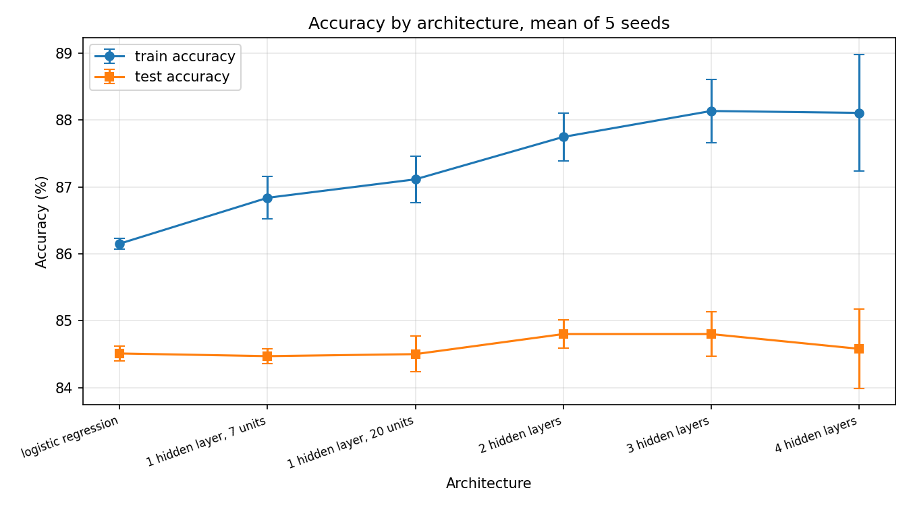
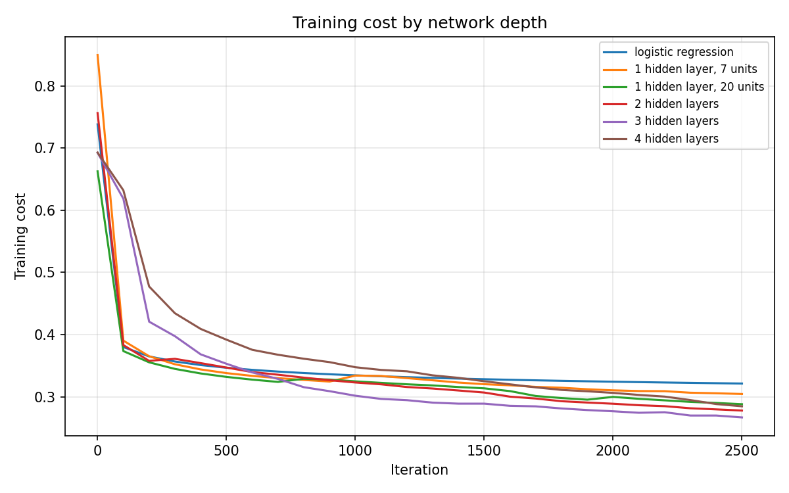

# Does Depth Help?

**A controlled study of network depth, written from scratch in NumPy.**

[](https://www.python.org/)
[](https://numpy.org/)
[](tests/test_shapes.py)
[](LICENSE)

Six architectures, from plain logistic regression to a four-hidden-layer network, are
trained on the same images with the same hyperparameters and the same five random seeds.
Depth is the only variable that changes.

Across 30 training runs, **no architecture beats logistic regression by a margin
larger than its own run-to-run noise.** Depth lowers training error and leaves test
accuracy flat.

---

## Contents

| Section | Section |
| :--- | :--- |
| [Results](#results) | [Installation](#installation) |
| [Findings](#findings) | [Usage](#usage) |
| [Background](#background) | [Tests](#tests) |
| [Method](#method) | [Scope](#scope) |
| [Choosing the learning rate](#choosing-the-learning-rate) | [Reproducibility](#reproducibility) |
| [Repository layout](#repository-layout) | [References](#references) |

---

## Results

Fashion-MNIST, T-shirt/top against Shirt. 12,000 training images, 2,000 test images,
784 features per image. Each row is the mean of five seeds, plus or minus the sample
standard deviation across them.

### Accuracy by architecture

| Architecture | Layer sizes | Train accuracy | Test accuracy | Gap | Final cost |
| :--- | :--- | ---: | ---: | ---: | ---: |
| Logistic regression | `784-1` | 86.15 ± 0.08 | 84.51 ± 0.11 | 1.64 | 0.3215 |
| 1 hidden layer, 7 units | `784-7-1` | 86.84 ± 0.32 | 84.47 ± 0.11 | 2.37 | 0.3060 |
| 1 hidden layer, 20 units | `784-20-1` | 87.11 ± 0.35 | 84.50 ± 0.27 | 2.61 | 0.2892 |
| 2 hidden layers | `784-20-7-1` | 87.75 ± 0.36 | **84.80 ± 0.21** | 2.95 | 0.2733 |
| 3 hidden layers | `784-20-7-5-1` | **88.14 ± 0.48** | **84.80 ± 0.33** | 3.34 | **0.2624** |
| 4 hidden layers | `784-20-20-7-5-1` | 88.11 ± 0.87 | 84.58 ± 0.59 | 3.53 | 0.2670 |

<p align="center">
  
</p>

<p align="center">
  <em>The gap between the two lines widens as depth increases. Training accuracy climbs;
  test accuracy does not follow.</em>
</p>

### Comparison with the baseline

Every architecture trains on the same five seeds, so each one can be compared with the
baseline seed by seed. Pairing this way removes the variation caused by initialisation
and leaves only the effect of the architecture.

| Architecture | Difference | 95% interval | Significant |
| :--- | ---: | :---: | :---: |
| 1 hidden layer, 7 units | −0.04 | [−0.25, +0.17] | no |
| 1 hidden layer, 20 units | −0.01 | [−0.44, +0.42] | no |
| 2 hidden layers | +0.29 | [−0.04, +0.62] | no |
| 3 hidden layers | +0.29 | [−0.03, +0.61] | no |
| 4 hidden layers | +0.07 | [−0.59, +0.73] | no |

Every interval contains zero.

### Training dynamics

<p align="center">
  
</p>

<p align="center">
  <em>Every network with a hidden layer converges below logistic regression, and the
  three-layer network lowest of all. Read against the figure above, that lower cost buys
  no test accuracy.</em>
</p>

---

## Findings

**No architecture beats the baseline significantly.** The largest gain is 0.29 points,
shared by the two and three hidden layer networks. Every interval reaches below zero. The
intervals span 0.42 to 1.32 points, so an effect this small cannot be separated from
run-to-run noise at five seeds.

**Training accuracy rises with depth. Test accuracy does not.** Training accuracy climbs
from 86.15 to 88.14 percent. Test accuracy stays inside a 0.33-point band for every
architecture, including the deepest. The extra capacity fits the training set and stops
there.

**The generalisation gap widens without a single reversal.** The distance between
training and test accuracy grows from 1.64 points at zero hidden layers to 3.53 at four.
Each layer added fits the training data better and transfers no better.

**Deeper networks are less stable.** The standard deviation of test accuracy grows from
0.11 at zero hidden layers to 0.59 at four. The widest confidence interval belongs to
the deepest network at 1.32 points. Depth adds sensitivity to initialisation, which is
why five seeds were needed rather than three.

**Lower cost did not mean better predictions.** Ranked by training cost the order is
three, four, then two hidden layers. Ranked by test accuracy it is two, three, then four.
The four-layer network reaches a lower cost than the two-layer network, 0.2670 against
0.2733, and scores lower on the test set, 84.58 against 84.80. Training cost measures fit
to the training set and nothing else.

The conclusion is that on this task, with these tools, depth is not the lever that
matters. Batch gradient descent with no regularisation and no adaptive step size gives
extra layers no way to turn capacity into generalisation.

---

## Background

The Course 1 assignments end with a four-layer network beating logistic regression by ten
points on a cat classification task. That comparison uses 209 training images, which is
small enough that the result may say more about the dataset than about depth.

This project repeats the comparison under conditions that make the answer easier to
trust:

- **Fifty-seven times more training data**, so the models are not measured in the
  regime where any result is noise.
- **A harder class pair.** T-shirt/top and Shirt are both upper-body garments with
  similar silhouettes, so no model can score well on a coarse shape rule.
- **Identical hyperparameters** across all six models, so depth is isolated.
- **Five seeds per architecture**, so run-to-run noise is visible rather than hidden, and
  every comparison can carry a confidence interval.

---

## Method

### Data

Fashion-MNIST downloads on first run and is cached in `data/`. Classes 0 and 6 are
selected, giving 12,000 training and 2,000 test images. Each 28×28 image is flattened to
a 784-element column and divided by 255. The design matrix has shape `(784, m)`, one
column per example.

### Architecture

Every network is `[LINEAR -> RELU] x (L-1) -> LINEAR -> SIGMOID`. The sigmoid output is a
probability, and predictions use a threshold of 0.5.

### Initialisation

Weights are drawn from a standard normal distribution and divided by the square root of
the incoming layer size. Biases start at zero.

Random weights are necessary: zero weights would make every unit in a layer compute the
same value and receive the same gradient, leaving them identical forever. Biases have no
such problem, because the weights already break the symmetry.

### Training

Batch gradient descent on the cross-entropy cost. Learning rate 0.05, 2,500 iterations,
seeds 1 through 5. All 30 runs finish in about 79 minutes on a laptop CPU.

### Comparison

Differences against the baseline are taken seed by seed rather than between independent
means. The reported interval is the mean paired difference plus or minus 2.776 standard
errors, the two-sided 95 percent multiplier for four degrees of freedom.

---

## Choosing the learning rate

The step size is set by a sweep that ships with the repository, so the table below is
reproducible with one command. Five rates are tried on three architectures across three
seeds, using 3,000 training images and 800 iterations: 45 runs in total. Logistic
regression is excluded because only hidden layers can suffer the failure this sweep looks
for.

| Learning rate | Collapsed | 1 hidden layer, 7 units | 3 hidden layers | 4 hidden layers |
| ---: | :---: | ---: | ---: | ---: |
| 0.01 | 0 / 9 | 82.12 ± 0.73 | 80.62 ± 1.55 | 80.68 ± 0.65 |
| **0.05** | **0 / 9** | **83.38 ± 0.62** | **82.93 ± 0.64** | **83.40 ± 0.61** |
| 0.10 | 0 / 9 | 82.80 ± 0.59 | 82.83 ± 0.83 | 82.48 ± 0.77 |
| 0.25 | 1 / 9 | 83.75 ± 0.54 | 82.08 ± 1.83 | 72.03 ± 19.10 |
| 0.50 | 0 / 9 | 80.65 ± 2.68 | 81.92 ± 1.80 | 84.35 ± 0.48 |

A network has collapsed when it predicts a single class for every input, which scores
exactly 50.00 percent on this balanced test set. The sweep detects that by counting
distinct predictions rather than by thresholding accuracy, so an undertrained network is
never mistaken for a dead one.

One run collapsed: the four-hidden-layer network at a rate of 0.25, seed 1. The cause is
dead ReLU. A large gradient step pushes every unit in a hidden layer to a negative
pre-activation. ReLU outputs zero there, `relu_backward` zeroes the gradient, and no
update can revive the layer. The failure is silent, since training runs to completion and
reports a number. One dead run is enough to drag that architecture's mean to 72.03 and
its spread to 19.10.

A rate of 0.05 is chosen. It collapses nothing, gives the highest accuracy averaged over
the three architectures at 83.24 percent, and holds every spread at or below 0.64. It is
not best everywhere: 0.25 edges ahead on the single hidden layer and 0.50 on the
four-layer network. But both are erratic where 0.05 is steady, and the instability
concentrates on depth, the same relationship the main results show.

---

## Repository layout

```
numpy-nn-depth-study/
├── src/
│   ├── __init__.py               marks src as an importable package
│   ├── activations.py            sigmoid and relu, forward and backward
│   ├── initialization.py         weight and bias initialisation
│   ├── forward.py                one layer forward, then the whole network
│   ├── cost.py                   cross-entropy cost
│   ├── backward.py               one layer backward, then the whole network
│   ├── update.py                 gradient descent step
│   ├── model.py                  training loop, prediction, accuracy
│   └── data.py                   download, IDX parsing, class selection
├── experiments/
│   ├── run_depth_study.py        trains every architecture and writes results
│   └── tune_learning_rate.py     sweeps the step size and detects collapsed runs
├── tests/
│   ├── __init__.py               lets a bare pytest call resolve imports
│   └── test_shapes.py            29 tests covering shapes, behaviour, statistics
├── results/
│   ├── results.csv               one row per training run
│   ├── baseline_comparison.csv   paired differences against the baseline
│   ├── learning_rate_sweep.csv   one row per sweep run
│   ├── learning_rate_summary.csv aggregated sweep table
│   ├── accuracy_by_architecture.png
│   └── cost_curves.png
├── data/                         Fashion-MNIST archives, downloaded on first run
├── requirements.txt              numpy and matplotlib, plus pytest for the suite
├── pytest.ini                    test discovery settings
├── .gitignore                    excludes caches and the downloaded archives
├── LICENSE
└── README.md
```

Forward and backward propagation mirror each other. `linear_forward` pairs with
`linear_backward`, and `linear_activation_forward` pairs with
`linear_activation_backward`. The cache is split into a linear part and an activation
part, which is what allows an activation to be swapped without touching the linear code.

---

## Installation

```bash
git clone https://github.com/Umair-Waseem/numpy-nn-depth-study.git
cd numpy-nn-depth-study
pip install -r requirements.txt
```

NumPy and matplotlib are the only runtime dependencies. There is no deep learning
framework in this repository.

---

## Usage

Both experiments run from the repository root. Fashion-MNIST downloads automatically on
first use.

### Depth study

```bash
python -m experiments.run_depth_study
```

| Option | Default | Description |
| :--- | :---: | :--- |
| `--iterations` | `2500` | Gradient descent steps per run |
| `--learning-rate` | `0.05` | Step size |
| `--subset` | all | Cap on the number of training examples |

A short run checks the pipeline end to end without waiting for the full study.

```bash
python -m experiments.run_depth_study --subset 1500 --iterations 300
```

### Learning-rate sweep

```bash
python -m experiments.tune_learning_rate
```

| Option | Default | Description |
| :--- | :---: | :--- |
| `--iterations` | `800` | Gradient descent steps per run |
| `--subset` | `3000` | Training examples used |

The rates are fixed in the script rather than exposed as an option, so the table in
[Choosing the learning rate](#choosing-the-learning-rate) always matches what this command
produces.

### Single network

```python
from src.data import load_binary_pair
from src.model import L_layer_model, predict, accuracy

X_train, Y_train, X_test, Y_test = load_binary_pair(class_a=0, class_b=6)
parameters, history = L_layer_model(X_train, Y_train, [784, 20, 7, 1])
print(accuracy(predict(X_test, parameters), Y_test))
```

`history` is a list of `(iteration, cost)` pairs. Its final entry scores the parameters
that are returned, not the last sampled checkpoint.

---

## Tests

```bash
pytest
```

Twenty-nine tests cover every component. Most check shapes, because a gradient whose shape
does not match its parameter still broadcasts in NumPy and produces plausible but wrong
numbers rather than raising an error.

The suite also confirms that training reduces the cost, that the same seed produces the
same weights twice, that `update_parameters` returns new arrays instead of modifying its
input, that the recorded cost history ends on the returned parameters, that the baseline
comparison calls a consistent gain significant and a noisy one not, and that the command
line rejects a zero or negative iteration count, learning rate or subset size, that
collapse detection separates a dead network from a merely inaccurate one, and that the
sweep summary lines its columns up.

---

## Scope

This project uses only the methods taught in Course 1 of the Deep Learning
Specialization. The following are absent, and their absence is what the results measure:

| Excluded | Problem it would address |
| :--- | :--- |
| Mini-batch gradient descent | Slow convergence on the full training set |
| Momentum, RMSProp, Adam | Sensitivity to the learning rate |
| L2 regularisation, dropout | The widening generalisation gap |
| Batch normalisation | Instability in deeper networks |
| Learning rate schedules | The trade-off between speed and dead units |

Each row addresses one of the problems visible above. Adding any of them would change the
finding, which is why they are excluded.

---

## Reproducibility

Every figure in this README comes from one of two commands on a clean checkout: the depth
study for the results and findings, the sweep for the learning-rate table.

- Weights depend only on the seed, which is passed explicitly and never left to chance.
- `results.csv` records the architecture, seed, both accuracies, the final cost and the
  wall time for all 30 runs. `baseline_comparison.csv` records the paired differences.
- The recorded cost is measured on the parameters that are returned, so every row
  describes a single model.
- Every architecture receives identical data, identical hyperparameters and the same five
  seeds.
- Reported figures are means over seeds with the sample standard deviation alongside, and
  comparisons carry an explicit confidence interval.

---

## References

- Xiao, H., Rasul, K. and Vollgraf, R. (2017). *Fashion-MNIST: a Novel Image Dataset for
  Benchmarking Machine Learning Algorithms.*
  [arXiv:1708.07747](https://arxiv.org/abs/1708.07747)
- Ng, A. *Neural Networks and Deep Learning.* DeepLearning.AI, Course 1 of the Deep
  Learning Specialization.

Fashion-MNIST is distributed by Zalando SE under the MIT License.

---

## License

MIT. See [LICENSE](LICENSE).
